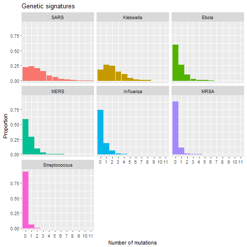

# gensig: simulating genetic signatures of transmission events

### Introduction
Pathogen genetic sequence data can inform us of likely transmission trees if
genetic variation is introduced at a rate high enough to resolve individual
tranmsission pairs. We quantify the informativeness of genetic sequence data in
informing likely transmission pairs by calculating the 'genetic signature',
defined as the average number of mutations seperating a given transmission
pair.

Here we describe the genetic signatures of various viral and bacterial pathogens
by simulating sequence evolution in the context of a simple transmission model,
drawing values for R0, mutation rates, genome lengths, generation times and the
degree of heterogeneity in infectiousness from the literature. By counting the
number of mutations seperating individual transmission pairs, we explicitly
describe the distribution of values for the genetic signature in realistic
outbreak scenarios. This will inform us of epidemic situations for which genetic
sequence data should be considered in inferring transmission trees and informing
the implementation of infection control measures.

 

### Results
We simulated outbreaks and pathogen sequence evolution using the following
parameters:

|Pathogen      | R0 |Mutation rate (base-1 day-1) |Genome length  (bases) |Generation time (SD) (days)  |
|:-------------|------:|:-----------------------------------------------------|:-------------------------|:-------------------------------|
|SARS          |    3.5|7.60e-06                                              |2.98e+04                  |8.4 (3.8)                       |
|Klebsiella    |    2.0|4.27e-09                                              |5.31e+06                  |62.7 (24)                       |
|Ebola         |    5.0|2.27e-06                                              |1.81e+04                  |15.3 (9.3)                      |
|MERS          |    3.5|1.67e-06                                              |3.01e+04                  |10.7 (6)                        |
|Influenza     |    1.3|7.93e-06                                              |1.32e+04                  |3 (1.5)                         |
|MRSA          |    1.3|2.39e-09                                              |2.84e+06                  |15.6 (10)                       |
|Streptococcus |    2.0|3.63e-09                                              |2.13e+06                  |6.6 (1.8)                       |

 
The distributions of realised generation times are given below.

### Contact
Finlay Campbell (f.campbell15@imperial.ac.uk)  
PhD Student  
Department of Infectious Disease Epidemiology  
Imperial College London  
